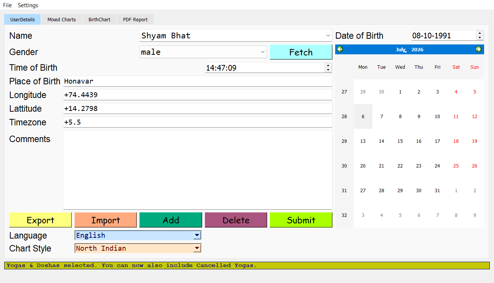

# JyotishyamPro

JyotishyamPro is a comprehensive, advanced Astrological Desktop Application built using Python and PyQt5. It empowers astrologers and astrology enthusiasts to generate and analyze Vedic astrological charts with ease, accuracy, and in various traditional styles.



## Features

- **Extensive Chart Generation**: Supports generating birth charts (Lagna, Navamsa, and all divisional charts from D1 up to D60).
- **Mixed & Transit Charts**: Overlay transit charts on top of natal charts dynamically for accurate predictive astrology.
- **Multiple Regional Styles**: Easily toggle between **North Indian** and **South Indian** chart styles.
- **Multi-language Support**: View planetary placements and astrological data in English, Kannada, and Hindi.
- **Comprehensive Analytics**: Computes and visually plots planetary strengths (Shadbala, Vimshopaka Bala, Bhava Bala) using beautiful Matplotlib integration.
- **Elemental Personality Matrix**: Analyzes the distribution of planets across the four elemental signs (Fire, Earth, Air, Water) to determine the native's core personality traits and dominant temperament.
- **In-Depth PDF Reports**: Generate extensive, multi-page astrological PDF reports dynamically rendered with charts. The report features:
  - **Basic Details & Panchang**: Tithi, Nakshatra, Yoga, Karana, etc.
  - **Charts**: Natal (Lagna) chart and up to 16 Divisional charts (Navamsa, Dasamsa, etc.) side-by-side.
  - **Planetary Strengths**: Vimshopaka Bala, Shadbala, Sthanabala, Kaalabala, Bhavabala tables and charts.
  - **Ashtakavarga**: SAV and individual BAV charts for all 7 planets.
  - **Vimshottari Dasha**: Comprehensive tables for Mahadasha, Antardasha, and Pratyantardasha (Bhukti).
  - **Yoga & Dosha Analysis**: Generates dynamic partial charts isolating the planets participating in each combination. Analyzes dozens of conditions including:
    - *Panchamahapurusha Yogas* (Ruchaka, Bhadra, Hamsa, Malavya, Sasa)
    - *Solar Combinations (Surya Yogas/Doshas)* (Vesi, Voshi, and Ubhayachari in Shubha/Papa/Mixed variations, Budhaditya/Nipuna Yoga)
    - *Lunar Combinations (Chandra Yogas/Doshas)* (Sunapha, Anapha, Durdhara, Kemadruma, Sakata, Adhi Yoga, Papa Adhi Dosha)
    - *Kartari Yogas/Doshas* (Shubha Kartari Yoga, Papa Kartari Dosha for all houses)
    - *Vipareeta Raja Yogas* (Harsha, Sarala, Vimala)
    - *Raja Yogas* (Neecha Bhanga, Dharma-Karmadhipati, Kendra-Trikona, Sreenatha, Chatussagara)
    - *Dhana Yogas* (Vasumathi)
    - *Kaala Sarpa Doshas* (All 12 types including Ananta, Kulika, Vasuki, etc.)
    - *Guru Yogas/Doshas* (Guru Chandala Dosha, Ganesha Yoga)
    - *Martian Afflictions* (Kuja Dosha / Mangal Dosha)
    - *Nabhasa Yogas* (Aashraya, Dala, Aakriti, Sankhya, Parivarthana)
    - *Miscellaneous Yogas* (Gaja Kesari, Chandra Mangala, Amala, Parvata, Kahala)
  - **House Lord Predictions**: Detailed interpretations of where the Lord of each House is positioned.
  - **Elemental Analysis**: Deep dive into the elemental composition of the chart with descriptive personality synthesis.
- **Vimshottari Dasha**: Track the timeline of Mahadasha, Antardasha, and Pratyantardasha directly within the app.

## Prerequisites

Before running the software, ensure you have Python installed on your system. 

## Installation

1. Clone this repository to your local machine:
   ```bash
   git clone https://github.com/yourusername/JyotishyamPro.git
   cd JyotishyamPro
   ```

2. Install all the required dependencies using the `requirements.txt` file:
   ```bash
   pip install -r requirements.txt
   ```

## Running the Application

To launch JyotishyamPro, execute the following command in the project's root directory:
```bash
python JyotishPro/main.py
```
*(Ensure that you navigate or point to the correct main file responsible for starting the PyQt5 application, e.g., `app.py`, `main.py`, or similar entry point of your project)*

## Tech Stack
- **UI Framework**: PyQt5
- **Astrology Engine**: jyotishyamitra, jyotichart, pyswisseph (via dependencies)
- **Data Visualization**: Matplotlib, Pandas
- **Document Generation**: fpdf2

## Project Structure
- `/support/`: Contains core business logic modules for calculations (`astrocalculations.py`, `balascalculation.py`, `dashascalculation.py`, etc.).
- `/userforms/`: Houses the raw `.ui` files and their translated python counterparts.
- `/images/`: Contains all generated SVG and PNG astrological chart image assets dynamically created during runtime.

## Contributing
Contributions are welcome! Please feel free to submit a Pull Request.

## License
This project is licensed under the MIT License - see the LICENSE file for details.
